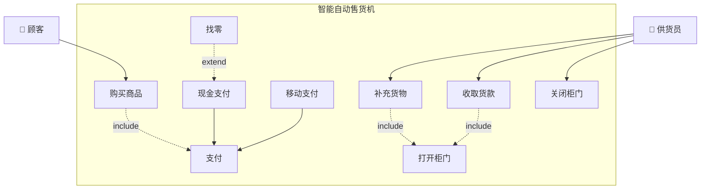

```mermaid
graph TB
    Customer["👤 顾客"]
    Supplier["👤 供货员"]
    
    subgraph System["智能自动售货机"]
        Buy["购买商品"]
        Pay["支付"]
        PayCash["现金支付"]
        PayMobile["移动支付"]
        GiveChange["找零"]
        
        Restock["补充货物"]
        CollectMoney["收取货款"]
        OpenDoor["打开柜门"]
        CloseDoor["关闭柜门"]
    end

    %% 顾客操作
    Customer --> Buy
    
    %% 包含关系
    Buy -.->|include| Pay

    %% 泛化关系
    PayCash --> Pay
    PayMobile --> Pay

    %% 扩展关系
    GiveChange -.->|extend| PayCash

    %% 供货员操作
    Supplier --> Restock
    Supplier --> CollectMoney
    Supplier --> CloseDoor

    %% 包含关系
    Restock -.->|include| OpenDoor
    CollectMoney -.->|include| OpenDoor
```