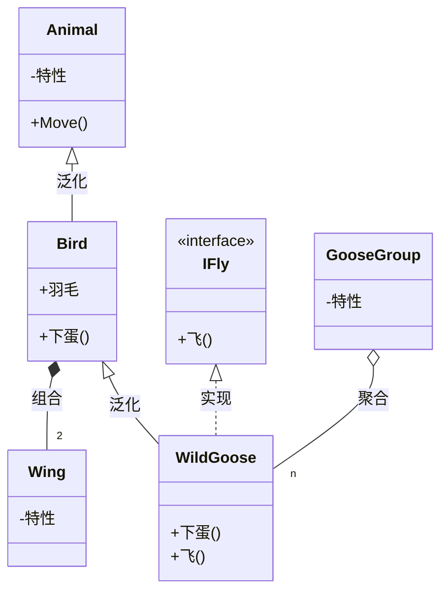

```mermaid
classDiagram
    class Animal {
        -特性
        +Move()
    }
    class Bird {
        +羽毛
        +下蛋()
    }
    class Wing {
        -特性
    }
    class WildGoose {
        +下蛋()
        +飞()
    }
    class GooseGroup {
        -特性
    }
    class IFly {
        <<interface>>
        +飞()
    }

    %% 泛化关系 (Generalization): 鸟继承动物
    Animal <|-- Bird : 泛化
    
    %% 组合关系 (Composition): 鸟拥有翅膀 (强拥有)
    Bird *-- "2" Wing : 组合
    
    %% 泛化关系 (Generalization): 大雁继承鸟
    Bird <|-- WildGoose : 泛化
    
    %% 实现关系 (Realization): 大雁实现飞翔接口
    IFly <|.. WildGoose : 实现
    
    %% 聚合关系 (Aggregation): 雁群包含大雁 (弱拥有)
    GooseGroup o-- "n" WildGoose : 聚合
```