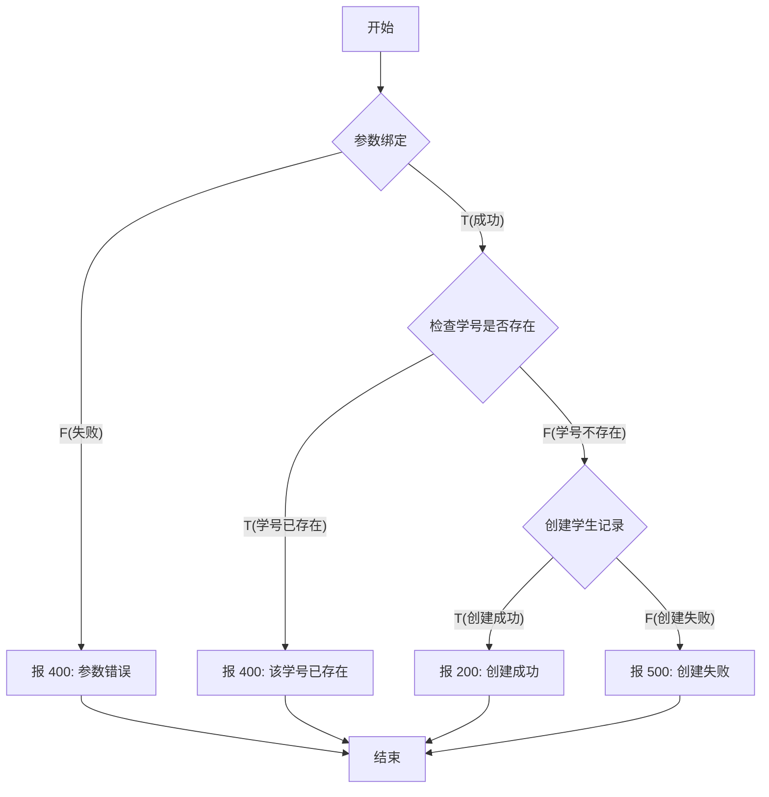

```mermaid
graph TD
    Start[开始] --> A{参数绑定};
    A -- T(成功) --> B{检查学号是否存在};
    A -- F(失败) --> C[报 400: 参数错误];
    B -- T(学号已存在) --> D[报 400: 该学号已存在];
    B -- F(学号不存在) --> E{创建学生记录};
    E -- T(创建成功) --> F[报 200: 创建成功];
    E -- F(创建失败) --> G[报 500: 创建失败];
    C --> End[结束];
    D --> End[结束];
    F --> End[结束];
    G --> End[结束];
```