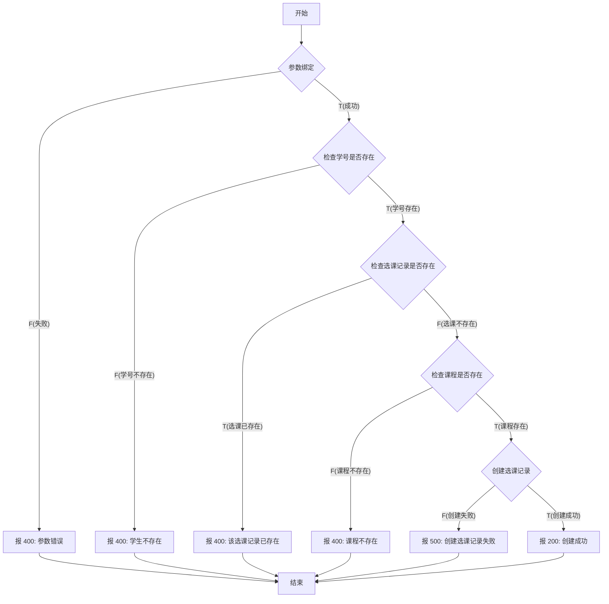

```mermaid
graph TD
    Start[开始] --> A{参数绑定};
    A -- F(失败) --> B[报 400: 参数错误];
    A -- T(成功) --> C{检查学号是否存在};
    C -- F(学号不存在) --> D[报 400: 学生不存在];
    C -- T(学号存在) --> E{检查选课记录是否存在};
    E -- T(选课已存在) --> F[报 400: 该选课记录已存在];
    E -- F(选课不存在) --> G{检查课程是否存在};
    G -- F(课程不存在) --> H[报 400: 课程不存在];
    G -- T(课程存在) --> I{创建选课记录};
    I -- F(创建失败) --> J[报 500: 创建选课记录失败];
    I -- T(创建成功) --> K[报 200: 创建成功];
    B --> End[结束];
    D --> End[结束];
    F --> End[结束];
    H --> End[结束];
    J --> End[结束];
    K --> End[结束];
```