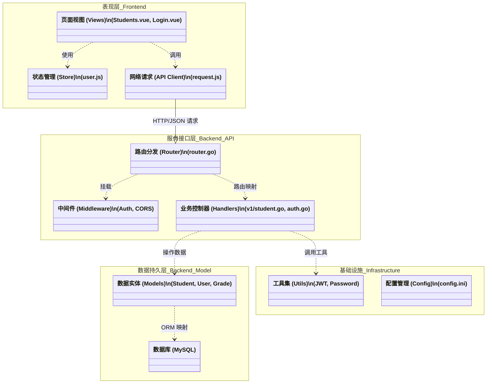

```mermaid
classDiagram
    direction TB

    %% 定义包样式
    classDef frontend fill:#e1f5fe,stroke:#01579b,stroke-width:2px
    classDef backend_api fill:#fff3e0,stroke:#e65100,stroke-width:2px
    classDef backend_model fill:#e8f5e9,stroke:#1b5e20,stroke-width:2px
    classDef infra fill:#f3e5f5,stroke:#4a148c,stroke-width:1px,stroke-dasharray: 5 5

    namespace 表现层_Frontend {
        class Vue_Views["页面视图 (Views)\n(Students.vue, Login.vue)"]
        class Pinia_Store["状态管理 (Store)\n(user.js)"]
        class Axios_Client["网络请求 (API Client)\n(request.js)"]
    }

    namespace 服务接口层_Backend_API {
        class Gin_Router["路由分发 (Router)\n(router.go)"]
        class Middleware["中间件 (Middleware)\n(Auth, CORS)"]
        class Handlers["业务控制器 (Handlers)\n(v1/student.go, auth.go)"]
    }

    namespace 数据持久层_Backend_Model {
        class Gorm_Models["数据实体 (Models)\n(Student, User, Grade)"]
        class MySQL_DB["数据库 (MySQL)"]
    }

    namespace 基础设施_Infrastructure {
        class Utils["工具集 (Utils)\n(JWT, Password)"]
        class Config["配置管理 (Config)\n(config.ini)"]
    }

    %% 依赖关系
    Vue_Views ..> Pinia_Store : 使用
    Vue_Views ..> Axios_Client : 调用
    Axios_Client --|> Gin_Router : HTTP/JSON 请求

    Gin_Router ..> Middleware : 挂载
    Gin_Router ..> Handlers : 路由映射

    Handlers ..> Gorm_Models : 操作数据
    Handlers ..> Utils : 调用工具

    Gorm_Models ..> MySQL_DB : ORM 映射
```