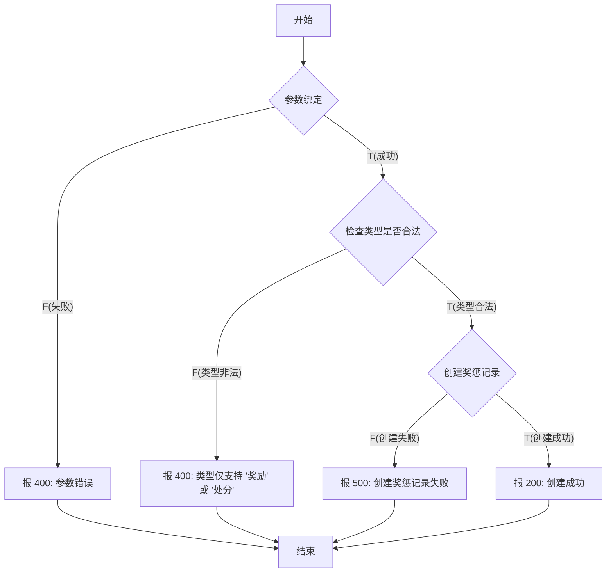

```mermaid
graph TD
    Start[开始] --> A{参数绑定};
    A -- F(失败) --> B[报 400: 参数错误];
    A -- T(成功) --> C{检查类型是否合法};
    C -- T(类型合法) --> D{创建奖惩记录};
    C -- F(类型非法) --> E[报 400: 类型仅支持 '奖励' 或 '处分'];
    D -- F(创建失败) --> F[报 500: 创建奖惩记录失败];
    D -- T(创建成功) --> G[报 200: 创建成功];
    B --> End[结束];
    E --> End[结束];
    F --> End[结束];
    G --> End[结束];
```