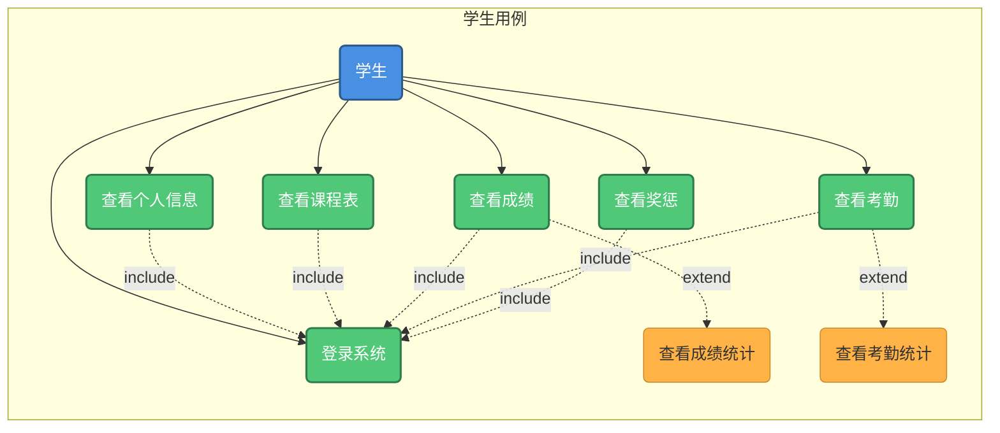

```mermaid
graph TD
    subgraph 学生用例 ["学生用例"]
        direction TB
        Student(学生)

        Student --> S_UC1(登录系统)
        Student --> S_UC2(查看个人信息)
        Student --> S_UC3(查看课程表)
        Student --> S_UC4(查看成绩)
        Student --> S_UC5(查看考勤)
        Student --> S_UC6(查看奖惩)
        
        %% include关系
        S_UC2 -.->|include| S_UC1
        S_UC3 -.->|include| S_UC1
        S_UC4 -.->|include| S_UC1
        S_UC5 -.->|include| S_UC1
        S_UC6 -.->|include| S_UC1
        
        %% extend关系
        S_UC4 -.->|extend| S_UC4_1(查看成绩统计)
        S_UC5 -.->|extend| S_UC5_1(查看考勤统计)
    end
    
    %% 样式定义
    classDef actor fill:#4A90E2,stroke:#2E5C8A,stroke-width:2px,color:#fff
    classDef mainUC fill:#50C878,stroke:#2E7D4E,stroke-width:2px,color:#fff
    classDef extendUC fill:#FFB347,stroke:#CC8A2E,stroke-width:1px,color:#333
    
    class Student actor
    class S_UC1,S_UC2,S_UC3,S_UC4,S_UC5,S_UC6 mainUC
    class S_UC4_1,S_UC5_1 extendUC
```