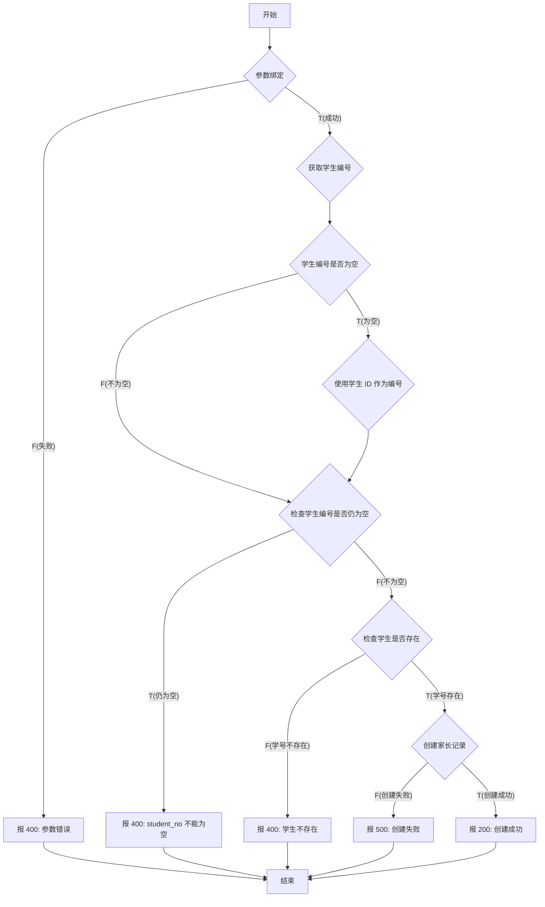

```mermaid
graph TD
    Start[开始] --> A{参数绑定};
    A -- F(失败) --> B[报 400: 参数错误];
    A -- T(成功) --> C{获取学生编号};
    C --> D{学生编号是否为空};
    D -- T(为空) --> E{使用学生 ID 作为编号};
    D -- F(不为空) --> F{检查学生编号是否仍为空};
    E --> F;
    F -- T(仍为空) --> G[报 400: student_no 不能为空];
    F -- F(不为空) --> H{检查学生是否存在};
    H -- F(学号不存在) --> I[报 400: 学生不存在];
    H -- T(学号存在) --> J{创建家长记录};
    J -- F(创建失败) --> K[报 500: 创建失败];
    J -- T(创建成功) --> L[报 200: 创建成功];
    B --> End[结束];
    G --> End[结束];
    I --> End[结束];
    K --> End[结束];
    L --> End[结束];
```