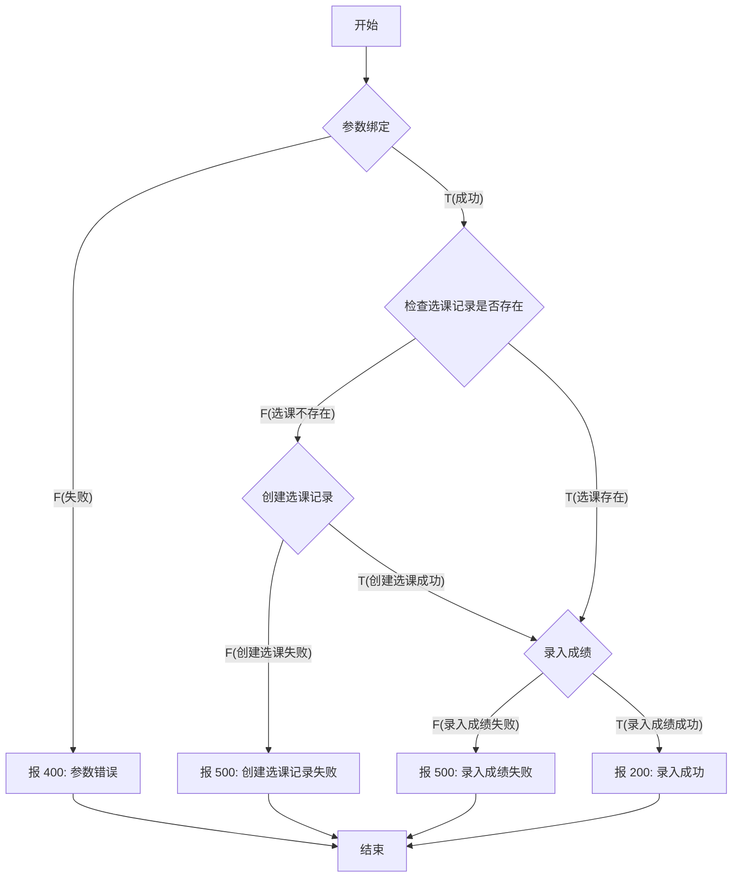

```mermaid
graph TD
    Start[开始] --> A{参数绑定};
    A -- F(失败) --> B[报 400: 参数错误];
    A -- T(成功) --> C{检查选课记录是否存在};
    C -- F(选课不存在) --> D{创建选课记录};
    C -- T(选课存在) --> G{录入成绩};
    D -- F(创建选课失败) --> E[报 500: 创建选课记录失败];
    D -- T(创建选课成功) --> G;
    G -- F(录入成绩失败) --> H[报 500: 录入成绩失败];
    G -- T(录入成绩成功) --> I[报 200: 录入成功];
    B --> End[结束];
    E --> End[结束];
    H --> End[结束];
    I --> End[结束];
```