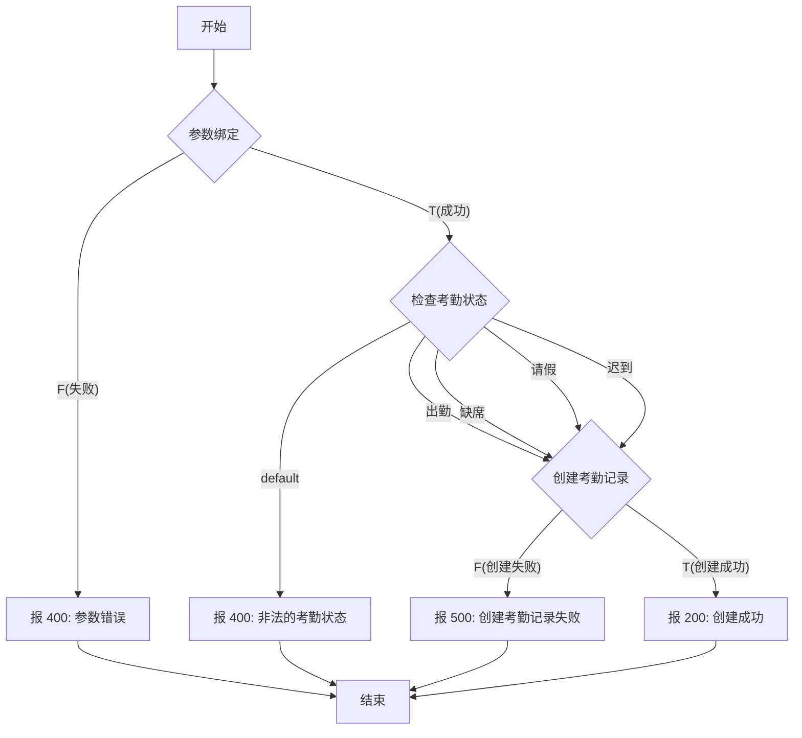

```mermaid
graph TD
    Start[开始] --> A{参数绑定};
    A -- F(失败) --> B[报 400: 参数错误];
    A -- T(成功) --> C{检查考勤状态};
    C -- 出勤 --> D{创建考勤记录};
    C -- 缺席 --> D;
    C -- 请假 --> D;
    C -- 迟到 --> D;
    C -- default --> E[报 400: 非法的考勤状态];
    D -- F(创建失败) --> F[报 500: 创建考勤记录失败];
    D -- T(创建成功) --> G[报 200: 创建成功];
    B --> End[结束];
    E --> End[结束];
    F --> End[结束];
    G --> End[结束];
```