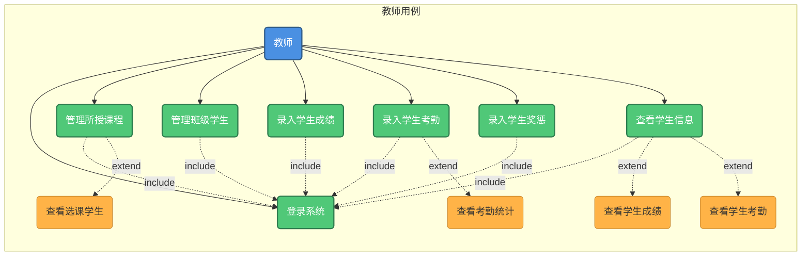

```mermaid
graph TD
    subgraph 教师用例["教师用例"]
        direction TB
        Teacher(教师)

        Teacher --> T_UC1(登录系统)
        Teacher --> T_UC2(管理所授课程)
        Teacher --> T_UC3(管理班级学生)
        Teacher --> T_UC4(录入学生成绩)
        Teacher --> T_UC5(录入学生考勤)
        Teacher --> T_UC6(录入学生奖惩)
        Teacher --> T_UC7(查看学生信息)
        
        %% include关系
        T_UC2 -.->|include| T_UC1
        T_UC3 -.->|include| T_UC1
        T_UC4 -.->|include| T_UC1
        T_UC5 -.->|include| T_UC1
        T_UC6 -.->|include| T_UC1
        T_UC7 -.->|include| T_UC1
        
        %% extend关系 - 考勤管理
        T_UC5 -.->|extend| T_UC5_1(查看考勤统计)
        
        %% extend关系 - 学生信息
        T_UC7 -.->|extend| T_UC7_1(查看学生成绩)
        T_UC7 -.->|extend| T_UC7_2(查看学生考勤)
        
        %% extend关系 - 课程管理
        T_UC2 -.->|extend| T_UC2_1(查看选课学生)
    end
    
    %% 样式定义
    classDef actor fill:#4A90E2,stroke:#2E5C8A,stroke-width:2px,color:#fff
    classDef mainUC fill:#50C878,stroke:#2E7D4E,stroke-width:2px,color:#fff
    classDef extendUC fill:#FFB347,stroke:#CC8A2E,stroke-width:1px,color:#333
    
    class Teacher actor
    class T_UC1,T_UC2,T_UC3,T_UC4,T_UC5,T_UC6,T_UC7 mainUC
    class T_UC5_1,T_UC7_1,T_UC7_2,T_UC2_1 extendUC
```