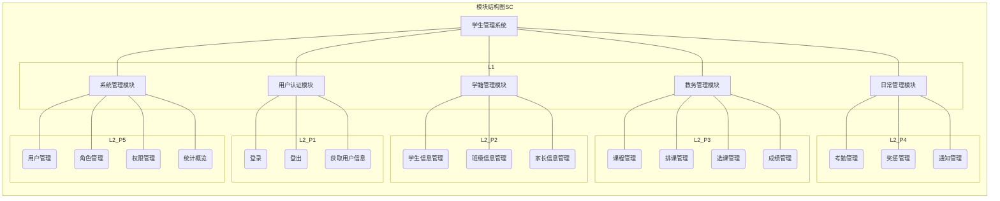

```mermaid
graph LR
    subgraph 模块结构图SC
        SMS[学生管理系统]

        subgraph L1
            P1[用户认证模块]
            P2[学籍管理模块]
            P3[教务管理模块]
            P4[日常管理模块]
            P5[系统管理模块]
        end

        SMS --- P1
        SMS --- P2
        SMS --- P3
        SMS --- P4
        SMS --- P5

        subgraph L2_P1
            P1_1(登录)
            P1_2(登出)
            P1_3(获取用户信息)
        end
        P1 --- P1_1
        P1 --- P1_2
        P1 --- P1_3

        subgraph L2_P2
            P2_1(学生信息管理)
            P2_2(班级信息管理)
            P2_3(家长信息管理)
        end
        P2 --- P2_1
        P2 --- P2_2
        P2 --- P2_3
        
        subgraph L2_P3
            P3_1(课程管理)
            P3_2(排课管理)
            P3_3(选课管理)
            P3_4(成绩管理)
        end
        P3 --- P3_1
        P3 --- P3_2
        P3 --- P3_3
        P3 --- P3_4
        
        subgraph L2_P4
            P4_1(考勤管理)
            P4_2(奖惩管理)
            P4_3(通知管理)
        end
        P4 --- P4_1
        P4 --- P4_2
        P4 --- P4_3

        subgraph L2_P5
            P5_1(用户管理)
            P5_2(角色管理)
            P5_3(权限管理)
            P5_4(统计概览)
        end
        P5 --- P5_1
        P5 --- P5_2
        P5 --- P5_3
        P5 --- P5_4
    end
```