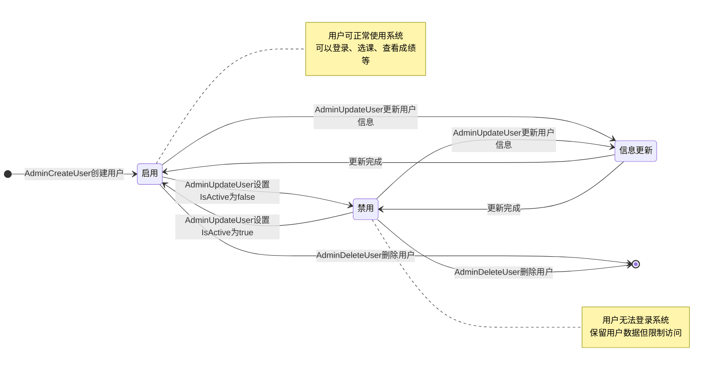

```mermaid
stateDiagram-v2
    direction LR
    
    [*] --> 启用: AdminCreateUser创建用户
    
    启用 --> 禁用: AdminUpdateUser设置IsActive为false
    禁用 --> 启用: AdminUpdateUser设置IsActive为true
    
    启用 --> 信息更新: AdminUpdateUser更新用户信息
    信息更新 --> 启用: 更新完成
    
    禁用 --> 信息更新: AdminUpdateUser更新用户信息
    信息更新 --> 禁用: 更新完成
    
    启用 --> [*]: AdminDeleteUser删除用户
    禁用 --> [*]: AdminDeleteUser删除用户
    
    note right of 启用
        用户可正常使用系统
        可以登录、选课、查看成绩等
    end note
    
    note right of 禁用
        用户无法登录系统
        保留用户数据但限制访问
    end note
```