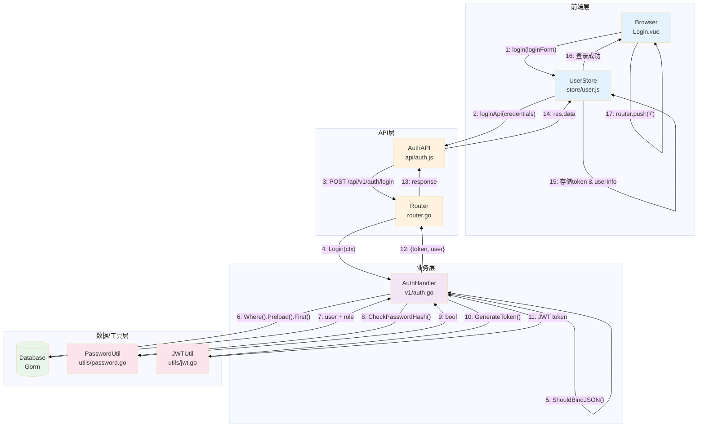

```mermaid
%%{init: {'theme':'base', 'themeVariables': {
  'fontSize': '16px',
  'fontFamily':'Arial'
}}}%%
graph TB
    subgraph "前端层"
        B["Browser<br/>Login.vue"]
        S["UserStore<br/>store/user.js"]
    end
    
    subgraph "API层"
        A["AuthAPI<br/>api/auth.js"]
        R["Router<br/>router.go"]
    end
    
    subgraph "业务层"
        H["AuthHandler<br/>v1/auth.go"]
    end
    
    subgraph "数据/工具层"
        DB[("Database<br/>Gorm")]
        P["PasswordUtil<br/>utils/password.go"]
        J["JWTUtil<br/>utils/jwt.go"]
    end
    
    B -->|"1: login(loginForm)"| S
    S -->|"2: loginApi(credentials)"| A
    A -->|"3: POST /api/v1/auth/login"| R
    R -->|"4: Login(ctx)"| H
    
    H -->|"5: ShouldBindJSON()"| H
    H -->|"6: Where().Preload().First()"| DB
    DB -->|"7: user + role"| H
    
    H -->|"8: CheckPasswordHash()"| P
    P -->|"9: bool"| H
    
    H -->|"10: GenerateToken()"| J
    J -->|"11: JWT token"| H
    
    H -->|"12: {token, user}"| R
    R -->|"13: response"| A
    A -->|"14: res.data"| S
    S -->|"15: 存储token & userInfo"| S
    S -->|"16: 登录成功"| B
    B -->|"17: router.push('/')"| B
    
    style B fill:#e3f2fd
    style S fill:#e3f2fd
    style A fill:#fff3e0
    style R fill:#fff3e0
    style H fill:#f3e5f5
    style DB fill:#e8f5e9
    style P fill:#fce4ec
    style J fill:#fce4ec
```