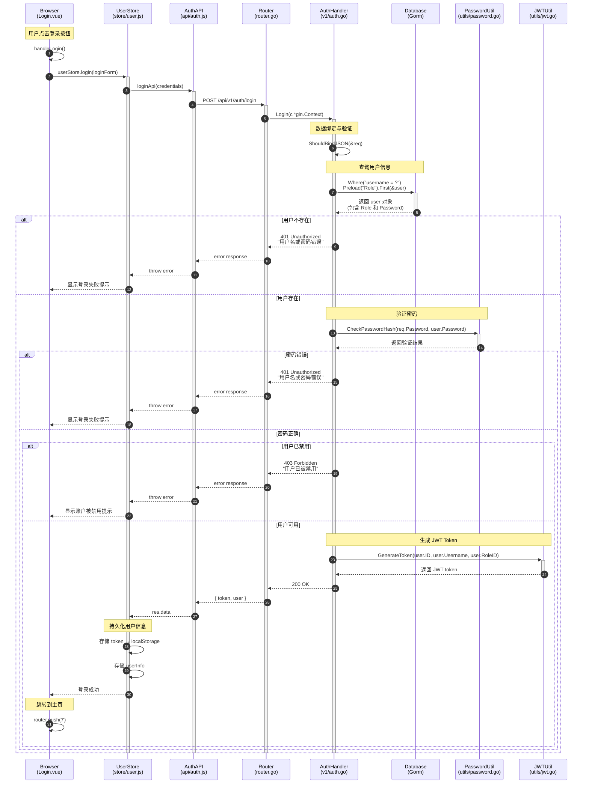

```mermaid
%%{init: {'theme':'base', 'themeVariables': {
  'fontSize': '18px',         /* 1. 基础字体大小 */
  'actorFontSize': '18px',    /* 2. 参与者 (Actor) 字体 */
  'noteFontSize': '18px',     /* 3. 注释 (Note) 字体 */
  'messageFontSize': '18px',  /* 4. 消息 (Message) 字体 */
  
  'fontFamily':'Arial',
  'actorLineColor':'#333',
  'signalColor':'#333',
  'signalTextColor':'#000',
  'labelBoxBkgColor':'#e8f4f8',
  'labelBoxBorderColor':'#0288d1',
  'noteBkgColor':'#fff3cd',
  'noteBorderColor':'#856404'
}}}%%
sequenceDiagram
    autonumber
    participant B as Browser<br/>(Login.vue)
    participant S as UserStore<br/>(store/user.js)
    participant A as AuthAPI<br/>(api/auth.js)
    participant R as Router<br/>(router.go)
    participant H as AuthHandler<br/>(v1/auth.go)
    participant DB as Database<br/>(Gorm)
    participant P as PasswordUtil<br/>(utils/password.go)
    participant J as JWTUtil<br/>(utils/jwt.go)

    Note over B: 用户点击登录按钮
    B->>B: handleLogin()
    B->>+S: userStore.login(loginForm)
    S->>+A: loginApi(credentials)
    A->>+R: POST /api/v1/auth/login
    R->>+H: Login(c *gin.Context)
    
    Note over H: 数据绑定与验证
    H->>H: ShouldBindJSON(&req)
    
    Note over H,DB: 查询用户信息
    H->>+DB: Where("username = ?")<br/>Preload("Role").First(&user)
    DB-->>-H: 返回 user 对象<br/>(包含 Role 和 Password)
    
    alt 用户不存在
        H-->>R: 401 Unauthorized<br/>"用户名或密码错误"
        R-->>A: error response
        A-->>S: throw error
        S-->>B: 显示登录失败提示
        
    else 用户存在
        Note over H,P: 验证密码
        H->>+P: CheckPasswordHash(req.Password, user.Password)
        P-->>-H: 返回验证结果
        
        alt 密码错误
            H-->>R: 401 Unauthorized<br/>"用户名或密码错误"
            R-->>A: error response
            A-->>S: throw error
            S-->>B: 显示登录失败提示
            
        else 密码正确
            
            alt 用户已禁用
                H-->>R: 403 Forbidden<br/>"用户已被禁用"
                R-->>A: error response
                A-->>S: throw error
                S-->>B: 显示账户被禁用提示
                
            else 用户可用
                Note over H,J: 生成 JWT Token
                H->>+J: GenerateToken(user.ID, user.Username, user.RoleID)
                J-->>-H: 返回 JWT token
                
                H-->>R: 200 OK
                R-->>A: { token, user }
                A-->>S: res.data
                
                Note over S: 持久化用户信息
                S->>S: 存储 token → localStorage
                S->>S: 存储 userInfo
                
                S-->>B: 登录成功
                
                Note over B: 跳转到主页
                B->>B: router.push('/')
            end
        end
    end
    
    deactivate H
    deactivate R
    deactivate A
    deactivate S
```