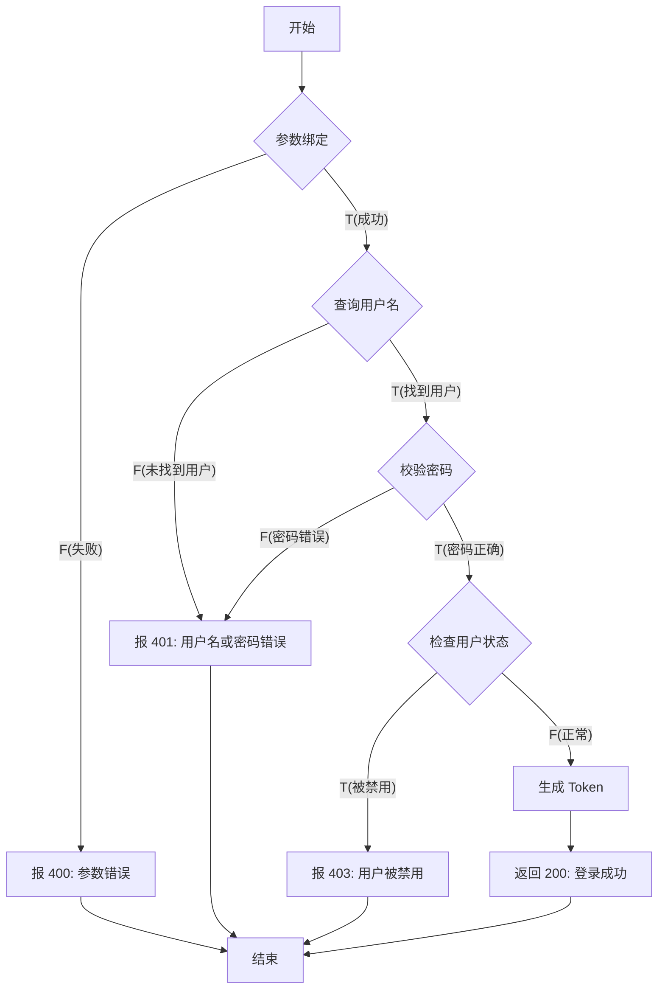

```mermaid
graph TD
    Start[开始] --> A{参数绑定};
    A -- T(成功) --> B{查询用户名};
    A -- F(失败) --> C[报 400: 参数错误];
    B -- T(找到用户) --> D{校验密码};
    B -- F(未找到用户) --> E[报 401: 用户名或密码错误];
    D -- T(密码正确) --> F{检查用户状态};
    D -- F(密码错误) --> E;
    F -- T(被禁用) --> G[报 403: 用户被禁用];
    F -- F(正常) --> H[生成 Token];
    H --> I[返回 200: 登录成功];
    C --> End[结束];
    E --> End[结束];
    G --> End[结束];
    I --> End[结束];
```