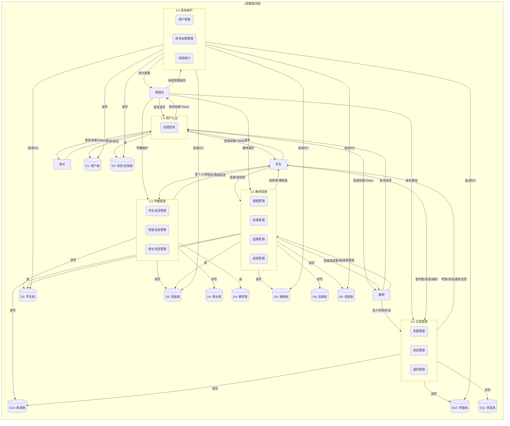

```mermaid
graph TD
    subgraph 1层数据流图
        direction TB

        E1[学生]
        E2[教师]
        E3[管理员]
        E4[家长]

        subgraph P1[1.0 用户认证]
            direction LR
            P1_1(处理登录)
        end
        
        subgraph P2[2.0 学籍管理]
            direction LR
            P2_1(学生信息管理)
            P2_2(班级信息管理)
            P2_3(家长信息管理)
        end
        
        subgraph P3[3.0 教务管理]
            direction LR
            P3_1(课程管理)
            P3_2(排课管理)
            P3_3(选课管理)
            P3_4(成绩管理)
        end
        
        subgraph P4[4.0 日常管理]
            direction LR
            P4_1(考勤管理)
            P4_2(奖惩管理)
            P4_3(通知管理)
        end
        
        subgraph P5[5.0 系统维护]
            direction LR
            P5_1(用户管理)
            P5_2(角色权限管理)
            P5_3(系统统计)
        end

        D1[(D1: 用户表)]
        D2[(D2: 角色/权限表)]
        D3[(D3: 学生表)]
        D4[(D4: 教师表)]
        D5[(D5: 班级表)]
        D6[(D6: 课程表)]
        D7[(D8: 选课表)]
        D8[(D9: 成绩表)]
        D9[(D10: 考勤表)]
        D10[(D11: 奖惩表)]
        D11[(D4: 家长表)]
        D12[(D13: 排课表)]
        
        E1 -- 登录请求 --> P1
        E2 -- 登录请求 --> P1
        E3 -- 登录请求 --> P1
        E4 -- 登录请求 --> P1
        P1 -- 读/验证 --> D1
        P1 -- 读 --> D2
        P1 -- 登录结果/Token --> E1
        P1 -- 登录结果/Token --> E2
        P1 -- 登录结果/Token --> E3
        P1 -- 登录结果/Token --> E4

        E3 -- 学籍维护 --> P2
        P2 -- 读写 --> D3
        P2 -- 读写 --> D5
        P2 -- 读写 --> D11
        P2 -- 读 --> D4
        E1 -- 查个人/班级信息 --> P2
        P2 -- 学生/班级信息 --> E1

        E2 -- 课程/成绩管理 --> P3
        E1 -- 选课/查成绩 --> P3
        E3 -- 教务维护 --> P3
        P3 -- 读写 --> D6
        P3 -- 读写 --> D12
        P3 -- 读写 --> D7
        P3 -- 读写 --> D8
        P3 -- 读 --> D3
        P3 -- 读 --> D5
        P3 -- 成绩单/课程表 --> E1
        P3 -- 班级成绩单 --> E2

        E2 -- 录入考勤/奖惩 --> P4
        E3 -- 发布通知 --> P4
        E1 -- 查考勤/奖惩/通知 --> P4
        P4 -- 读写 --> D9
        P4 -- 读写 --> D10
        P4 -- 读写 --> D12
        P4 -- 考勤/奖惩/通知信息 --> E1

        E3 -- 系统管理操作 --> P5
        P5 -- 读写 --> D1
        P5 -- 读写 --> D2
        P5 -- "读(统计)" --> D3
        P5 -- "读(统计)" --> D5
        P5 -- "读(统计)" --> D6
        P5 -- "读(统计)" --> D8
        P5 -- "读(统计)" --> D9
        P5 -- 统计报表 --> E3
    end
```