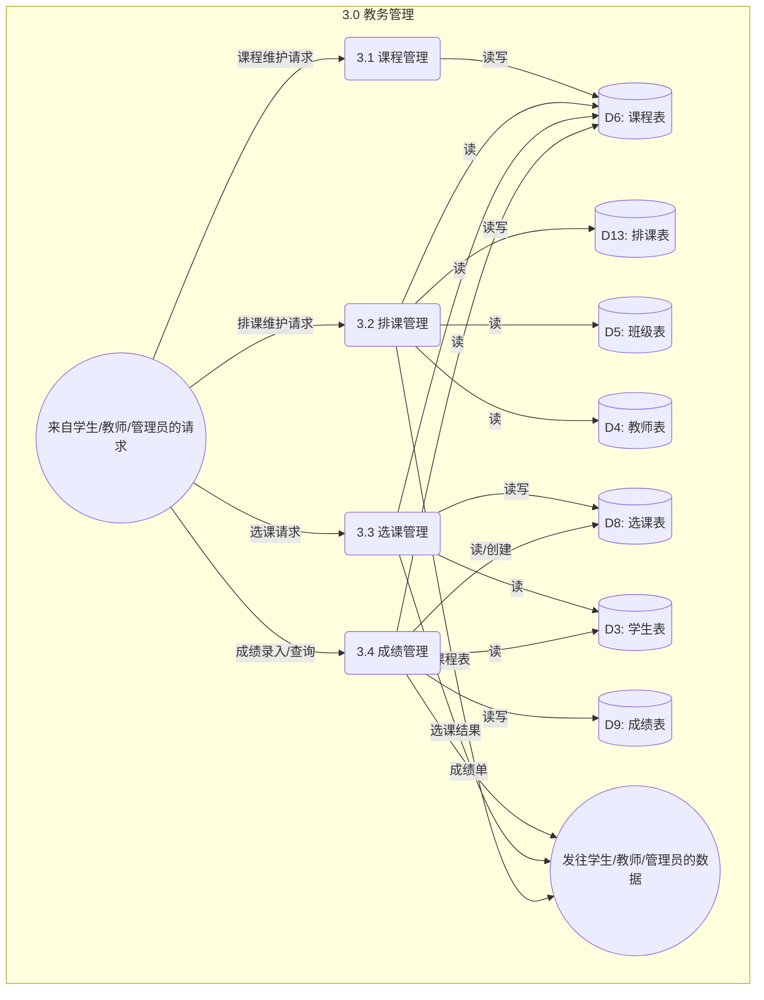

```mermaid
graph TD
    subgraph 3.0 教务管理
        direction LR

        E_In((来自学生/教师/管理员的请求))
        E_Out((发往学生/教师/管理员的数据))
        
        P3_1(3.1 课程管理)
        P3_2(3.2 排课管理)
        P3_3(3.3 选课管理)
        P3_4(3.4 成绩管理)

        D3[(D3: 学生表)]
        D4[(D4: 教师表)]
        D5[(D5: 班级表)]
        D6[(D6: 课程表)]
        D7[(D8: 选课表)]
        D8[(D9: 成绩表)]
        D12[(D13: 排课表)]
        
        E_In -- 课程维护请求 --> P3_1
        P3_1 -- 读写 --> D6
        
        E_In -- 排课维护请求 --> P3_2
        P3_2 -- 读写 --> D12
        P3_2 -- 读 --> D6
        P3_2 -- 读 --> D5
        P3_2 -- 读 --> D4

        E_In -- 选课请求 --> P3_3
        P3_3 -- 读写 --> D7
        P3_3 -- 读 --> D3
        P3_3 -- 读 --> D6
        
        E_In -- 成绩录入/查询 --> P3_4
        P3_4 -- 读/创建 --> D7
        P3_4 -- 读写 --> D8
        P3_4 -- 读 --> D3
        P3_4 -- 读 --> D6
        
        P3_4 -- 成绩单 --> E_Out
        P3_3 -- 选课结果 --> E_Out
        P3_2 -- 课程表 --> E_Out
    end
```