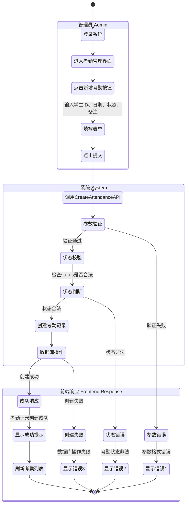

```mermaid
stateDiagram-v2
    [*] --> 登录系统

    state "管理员 Admin" as Admin {
        登录系统 --> 进入考勤管理界面
        进入考勤管理界面 --> 点击新增考勤按钮
        点击新增考勤按钮 --> 填写表单 : 输入学生ID、日期、状态、备注
        填写表单 --> 点击提交
    }

    点击提交 --> 调用CreateAttendanceAPI

    state "系统 System" as System {
        调用CreateAttendanceAPI --> 参数验证
        参数验证 --> 状态校验 : 验证通过
        参数验证 --> 参数错误 : 验证失败

        状态校验 --> 状态判断 : 检查status是否合法
        状态判断 --> 创建考勤记录 : 状态合法
        状态判断 --> 状态错误 : 状态非法

        创建考勤记录 --> 数据库操作
        数据库操作 --> 成功响应 : 创建成功
        数据库操作 --> 创建失败 : 创建失败
    }

    state "前端响应 Frontend Response" as Frontend {
        成功响应 --> 显示成功提示 : 考勤记录创建成功
        显示成功提示 --> 刷新考勤列表
        刷新考勤列表 --> [*]

        参数错误 --> 显示错误1 : 参数格式错误
        状态错误 --> 显示错误2 : 考勤状态非法
        创建失败 --> 显示错误3 : 数据库操作失败

        显示错误1 --> [*]
        显示错误2 --> [*]
        显示错误3 --> [*]
    }
```