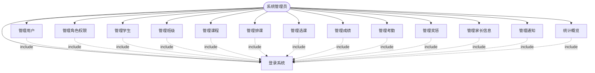

```mermaid
graph TD
    Admin([系统管理员])
    
    %% 核心用例
    Admin --> UC1[登录系统]
    Admin --> UC2[管理用户]
    Admin --> UC3[管理角色权限]
    Admin --> UC4[管理学生]
    Admin --> UC5[管理班级]
    Admin --> UC6[管理课程]
    Admin --> UC7[管理排课]
    Admin --> UC8[管理选课]
    Admin --> UC9[管理成绩]
    Admin --> UC10[管理考勤]
    Admin --> UC11[管理奖惩]
    Admin --> UC12[管理家长信息]
    Admin --> UC13[管理通知]
    Admin --> UC14[统计概览]
    
    %% include关系 - 所有操作需要登录
    UC2 -.->|include| UC1
    UC3 -.->|include| UC1
    UC4 -.->|include| UC1
    UC5 -.->|include| UC1
    UC6 -.->|include| UC1
    UC7 -.->|include| UC1
    UC8 -.->|include| UC1
    UC9 -.->|include| UC1
    UC10 -.->|include| UC1
    UC11 -.->|include| UC1
    UC12 -.->|include| UC1
    UC13 -.->|include| UC1
    UC14 -.->|include| UC1
```