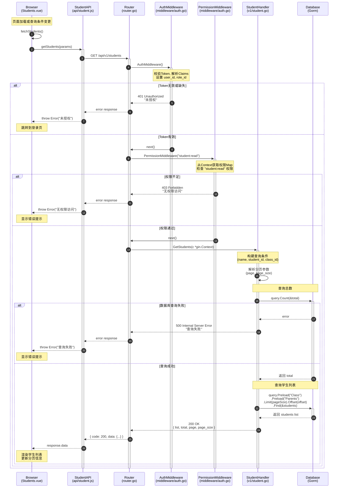

```mermaid
%%{init: {'theme':'base', 'themeVariables': {
  'fontSize': '18px',         /* 1. 基础字体大小 */
  'actorFontSize': '18px',    /* 2. 参与者 (Actor) 字体 */
  'noteFontSize': '18px',     /* 3. 注释 (Note) 字体 */
  'messageFontSize': '18px',  /* 4. 消息 (Message) 字体 */
  
  'fontFamily':'Arial',
  'actorLineColor':'#333',
  'signalColor':'#333',
  'signalTextColor':'#000',
  'labelBoxBkgColor':'#e8f4f8',
  'labelBoxBorderColor':'#0288d1',
  'noteBkgColor':'#fff3cd',
  'noteBorderColor':'#856404'
}}}%%
sequenceDiagram
    autonumber
    participant B as Browser<br/>(Students.vue)
    participant A as StudentAPI<br/>(api/student.js)
    participant R as Router<br/>(router.go)
    participant M1 as AuthMiddleware<br/>(middleware/auth.go)
    participant M2 as PermissionMiddleware<br/>(middleware/auth.go)
    participant H as StudentHandler<br/>(v1/student.go)
    participant DB as Database<br/>(Gorm)

    Note over B: 页面加载或查询条件变更
    B->>B: fetchStudents()
    B->>+A: getStudents(params)
    A->>+R: GET /api/v1/students
    R->>+M1: AuthMiddleware()
    
    Note over M1: 校验Token, 解析Claims<br/>设置 user_id, role_id
    
    alt Token无效或缺失
        M1-->>R: 401 Unauthorized<br/>"未授权"
        R-->>A: error response
        A-->>B: throw Error("未授权")
        Note over B: 跳转到登录页
        
    else Token有效
        M1->>R: next()
        R->>+M2: PermissionMiddleware("student:read")
        
        Note over M2: 从Context获取权限Map<br/>检查 "student:read" 权限
        
        alt 权限不足
            M2-->>R: 403 Forbidden<br/>"无权限访问"
            R-->>A: error response
            A-->>B: throw Error("无权限访问")
            Note over B: 显示错误提示
            
        else 权限通过
            M2->>R: next()
            R->>+H: GetStudents(c *gin.Context)
            
            Note over H: 构建查询条件<br/>(name, student_id, class_id)
            H->>H: 解析分页参数<br/>(page, page_size)
            
            Note over H,DB: 查询总数
            H->>+DB: query.Count(&total)
            
            alt 数据库查询失败
                DB-->>H: error
                H-->>R: 500 Internal Server Error<br/>"查询失败"
                R-->>A: error response
                A-->>B: throw Error("查询失败")
                Note over B: 显示错误提示
                
            else 查询成功
                DB-->>-H: 返回 total
                
                Note over H,DB: 查询学生列表
                H->>+DB: query.Preload("Class")<br/>.Preload("Parents")<br/>.Limit(pageSize).Offset(offset)<br/>.Find(&students)
                DB-->>-H: 返回 students list
                
                H-->>R: 200 OK<br/>{ list, total, page, page_size }
                R-->>A: { code: 200, data: {...} }
                A-->>B: response.data
                
                Note over B: 渲染学生列表<br/>更新分页信息
            end
        end
    end
    
    deactivate H
    deactivate M2
    deactivate M1
    deactivate R
    deactivate A
```