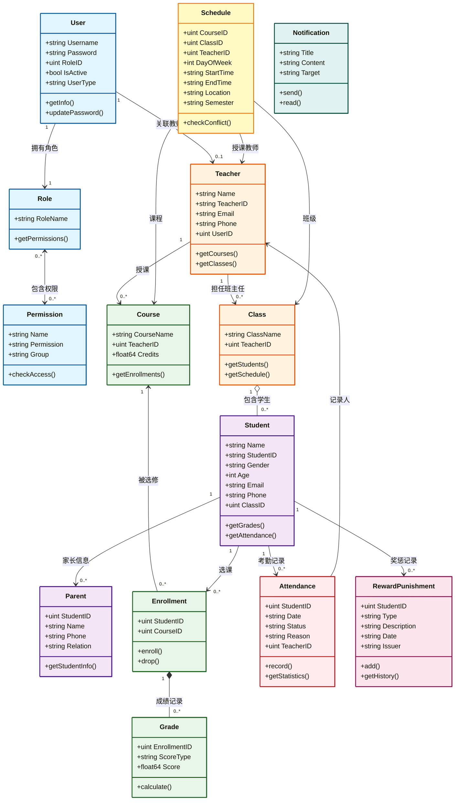

```mermaid
classDiagram
    direction TB
    
    %% ============ 用户权限模块 ============
    class User {
        +string Username
        +string Password
        +uint RoleID
        +bool IsActive
        +string UserType
        +getInfo()
        +updatePassword()
    }

    class Role {
        +string RoleName
        +getPermissions()
    }

    class Permission {
        +string Name
        +string Permission
        +string Group
        +checkAccess()
    }

    %% ============ 教师模块 ============
    class Teacher {
        +string Name
        +string TeacherID
        +string Email
        +string Phone
        +uint UserID
        +getCourses()
        +getClasses()
    }

    %% ============ 班级模块 ============
    class Class {
        +string ClassName
        +uint TeacherID
        +getStudents()
        +getSchedule()
    }

    %% ============ 学生模块 ============
    class Student {
        +string Name
        +string StudentID
        +string Gender
        +int Age
        +string Email
        +string Phone
        +uint ClassID
        +getGrades()
        +getAttendance()
    }

    class Parent {
        +uint StudentID
        +string Name
        +string Phone
        +string Relation
        +getStudentInfo()
    }

    %% ============ 课程模块 ============
    class Course {
        +string CourseName
        +uint TeacherID
        +float64 Credits
        +getEnrollments()
    }
    
    class Enrollment {
        +uint StudentID
        +uint CourseID
        +enroll()
        +drop()
    }

    class Grade {
        +uint EnrollmentID
        +string ScoreType
        +float64 Score
        +calculate()
    }

    %% ============ 课程表模块 ============
    class Schedule {
        +uint CourseID
        +uint ClassID
        +uint TeacherID
        +int DayOfWeek
        +string StartTime
        +string EndTime
        +string Location
        +string Semester
        +checkConflict()
    }

    %% ============ 考勤模块 ============
    class Attendance {
        +uint StudentID
        +string Date
        +string Status
        +string Reason
        +uint TeacherID
        +record()
        +getStatistics()
    }

    %% ============ 奖惩模块 ============
    class RewardPunishment {
        +uint StudentID
        +string Type
        +string Description
        +string Date
        +string Issuer
        +add()
        +getHistory()
    }
    
    %% ============ 通知模块 ============
    class Notification {
        +string Title
        +string Content
        +string Target
        +send()
        +read()
    }

    %% ============ 关系定义 ============
    
    %% 权限体系（顶层）
    User "1" --> "1" Role : 拥有角色
    Role "0..*" <--> "0..*" Permission : 包含权限
    
    %% 用户-教师关联
    User "1" --> "0..1" Teacher : 关联教师
    
    %% 教师-班级-学生主线
    Teacher "1" --> "0..*" Class : 担任班主任
    Class "1" o-- "0..*" Student : 包含学生
    
    %% 学生关联（右侧）
    Student "1" --> "0..*" Parent : 家长信息
    Student "1" --> "0..*" RewardPunishment : 奖惩记录
    Student "1" --> "0..*" Attendance : 考勤记录
    
    %% 课程体系（左侧）
    Teacher "1" --> "0..*" Course : 授课
    Course "1" <-- "0..*" Enrollment : 被选修
    Student "1" --> "0..*" Enrollment : 选课
    Enrollment "1" *-- "0..*" Grade : 成绩记录
    
    %% 课程表关联（中间桥接）
    Schedule --> Course : 课程
    Schedule --> Class : 班级
    Schedule --> Teacher : 授课教师
    
    %% 考勤记录关联
    Attendance --> Teacher : 记录人
    
    %% 样式定义
    style User fill:#e1f5ff,stroke:#01579b,stroke-width:2px
    style Role fill:#e1f5ff,stroke:#01579b,stroke-width:2px
    style Permission fill:#e1f5ff,stroke:#01579b,stroke-width:2px
    
    style Teacher fill:#fff3e0,stroke:#e65100,stroke-width:2px
    style Class fill:#fff3e0,stroke:#e65100,stroke-width:2px
    
    style Student fill:#f3e5f5,stroke:#4a148c,stroke-width:2px
    style Parent fill:#f3e5f5,stroke:#4a148c,stroke-width:2px
    
    style Course fill:#e8f5e9,stroke:#1b5e20,stroke-width:2px
    style Enrollment fill:#e8f5e9,stroke:#1b5e20,stroke-width:2px
    style Grade fill:#e8f5e9,stroke:#1b5e20,stroke-width:2px
    
    style Schedule fill:#fff9c4,stroke:#f57f17,stroke-width:2px
    style Attendance fill:#ffebee,stroke:#b71c1c,stroke-width:2px
    style RewardPunishment fill:#fce4ec,stroke:#880e4f,stroke-width:2px
    style Notification fill:#e0f2f1,stroke:#004d40,stroke-width:2px
```