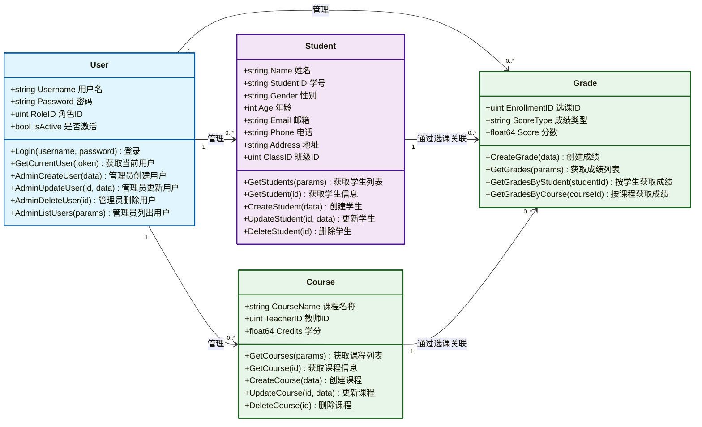

```mermaid
classDiagram
    direction LR

    class User {
        +string Username 用户名
        +string Password 密码
        +uint RoleID 角色ID
        +bool IsActive 是否激活
        +Login(username, password) 登录
        +GetCurrentUser(token) 获取当前用户
        +AdminCreateUser(data) 管理员创建用户
        +AdminUpdateUser(id, data) 管理员更新用户
        +AdminDeleteUser(id) 管理员删除用户
        +AdminListUsers(params) 管理员列出用户
    }

    class Student {
        +string Name 姓名
        +string StudentID 学号
        +string Gender 性别
        +int Age 年龄
        +string Email 邮箱
        +string Phone 电话
        +string Address 地址
        +uint ClassID 班级ID
        +GetStudents(params) 获取学生列表
        +GetStudent(id) 获取学生信息
        +CreateStudent(data) 创建学生
        +UpdateStudent(id, data) 更新学生
        +DeleteStudent(id) 删除学生
    }
    
    class Course {
        +string CourseName 课程名称
        +uint TeacherID 教师ID
        +float64 Credits 学分
        +GetCourses(params) 获取课程列表
        +GetCourse(id) 获取课程信息
        +CreateCourse(data) 创建课程
        +UpdateCourse(id, data) 更新课程
        +DeleteCourse(id) 删除课程
    }

    class Grade {
        +uint EnrollmentID 选课ID
        +string ScoreType 成绩类型
        +float64 Score 分数
        +CreateGrade(data) 创建成绩
        +GetGrades(params) 获取成绩列表
        +GetGradesByStudent(studentId) 按学生获取成绩
        +GetGradesByCourse(courseId) 按课程获取成绩
    }

    User "1" --> "0..*" Student : 管理
    User "1" --> "0..*" Course : 管理
    User "1" --> "0..*" Grade : 管理
    Student "1" --> "0..*" Grade : 通过选课关联
    Course "1" --> "0..*" Grade : 通过选课关联

    style User fill:#e1f5ff,stroke:#01579b,stroke-width:2px
    style Student fill:#f3e5f5,stroke:#4a148c,stroke-width:2px
    style Course fill:#e8f5e9,stroke:#1b5e20,stroke-width:2px
    style Grade fill:#e8f5e9,stroke:#1b5e20,stroke-width:2px
```