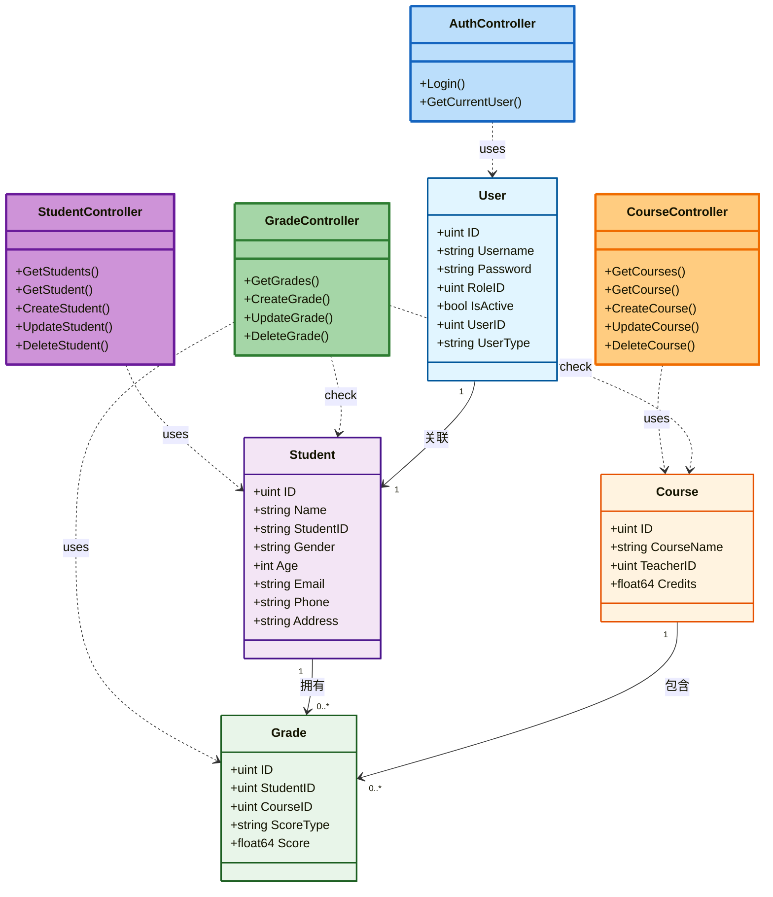

```mermaid
classDiagram
    direction TB

    %% ---------------------------------------------------------
    %% Controller 层 (逻辑层)
    %% ---------------------------------------------------------
    class AuthController {
        +Login()
        +GetCurrentUser()
    }
    class StudentController {
        +GetStudents()
        +GetStudent()
        +CreateStudent()
        +UpdateStudent()
        +DeleteStudent()
    }
    class CourseController {
        +GetCourses()
        +GetCourse()
        +CreateCourse()
        +UpdateCourse()
        +DeleteCourse()
    }
    class GradeController {
        +GetGrades()
        +CreateGrade()
        +UpdateGrade()
        +DeleteGrade()
    }

    %% ---------------------------------------------------------
    %% Entity 层 (数据层)
    %% ---------------------------------------------------------
    class User {
        +uint ID
        +string Username
        +string Password
        +uint RoleID
        +bool IsActive
        +uint UserID
        +string UserType
    }
    class Student {
        +uint ID
        +string Name
        +string StudentID
        +string Gender
        +int Age
        +string Email
        +string Phone
        +string Address
    }
    class Course {
        +uint ID
        +string CourseName
        +uint TeacherID
        +float64 Credits
    }
    class Grade {
        +uint ID
        +uint StudentID
        +uint CourseID
        +string ScoreType
        +float64 Score
    }

    %% ---------------------------------------------------------
    %% 关系定义
    %% ---------------------------------------------------------
    AuthController ..> User : uses
    StudentController ..> Student : uses
    CourseController ..> Course : uses
    GradeController ..> Grade : uses
    GradeController ..> Student : check
    GradeController ..> Course : check

    User "1" --> "1" Student : 关联
    Student "1" --> "0..*" Grade : 拥有
    Course "1" --> "0..*" Grade : 包含

    %% ---------------------------------------------------------
    %% 应用样式 (必须在最后定义)
    %% ---------------------------------------------------------
    style AuthController fill:#bbdefb,stroke:#1565c0,stroke-width:3px
    style StudentController fill:#ce93d8,stroke:#6a1b9a,stroke-width:3px
    style CourseController fill:#ffcc80,stroke:#ef6c00,stroke-width:3px
    style GradeController fill:#a5d6a7,stroke:#2e7d32,stroke-width:3px
    
    style User fill:#e1f5ff,stroke:#01579b,stroke-width:2px
    style Student fill:#f3e5f5,stroke:#4a148c,stroke-width:2px
    style Course fill:#fff3e0,stroke:#e65100,stroke-width:2px
    style Grade fill:#e8f5e9,stroke:#1b5e20,stroke-width:2px
```