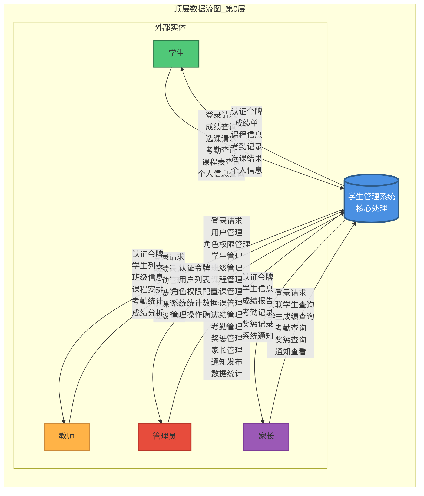

```mermaid
graph LR
    subgraph 顶层数据流图_第0层
        P[("学生管理系统<br/>核心处理")]
        
        subgraph 外部实体
            E1[学生]
            E2[教师]
            E3[管理员]
            E4[家长]
        end

        %% 学生数据流
        E1 -->|"登录请求<br/>成绩查询<br/>选课请求<br/>考勤查询<br/>课程表查询<br/>个人信息查询"| P
        P -->|"认证令牌<br/>成绩单<br/>课程信息<br/>考勤记录<br/>选课结果<br/>个人信息"| E1

        %% 教师数据流
        E2 -->|"登录请求<br/>成绩录入<br/>考勤管理<br/>奖惩管理<br/>排课管理<br/>班级管理"| P
        P -->|"认证令牌<br/>学生列表<br/>班级信息<br/>课程安排<br/>考勤统计<br/>成绩分析"| E2

        %% 管理员数据流
        E3 -->|"登录请求<br/>用户管理<br/>角色权限管理<br/>学生管理<br/>班级管理<br/>课程管理<br/>排课管理<br/>选课管理<br/>成绩管理<br/>考勤管理<br/>奖惩管理<br/>家长管理<br/>通知发布<br/>数据统计"| P
        P -->|"认证令牌<br/>用户列表<br/>角色权限配置<br/>系统统计数据<br/>管理操作确认"| E3
        
        %% 家长数据流
        E4 -->|"登录请求<br/>关联学生查询<br/>学生成绩查询<br/>考勤查询<br/>奖惩查询<br/>通知查看"| P
        P -->|"认证令牌<br/>学生信息<br/>成绩报告<br/>考勤记录<br/>奖惩记录<br/>系统通知"| E4
    end

    style P fill:#4A90E2,stroke:#2E5C8A,stroke-width:3px,color:#fff
    style E1 fill:#50C878,stroke:#2D7A4A,stroke-width:2px
    style E2 fill:#FFB347,stroke:#CC8A3A,stroke-width:2px
    style E3 fill:#E74C3C,stroke:#B93629,stroke-width:2px
    style E4 fill:#9B59B6,stroke:#7D3C98,stroke-width:2px
```